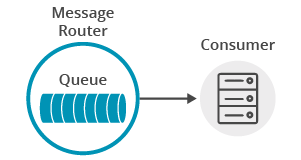
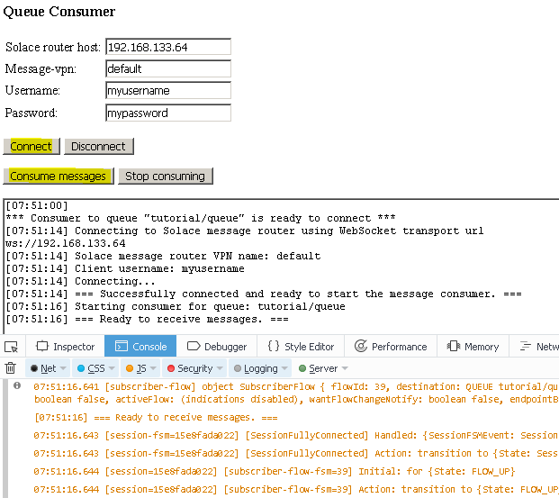
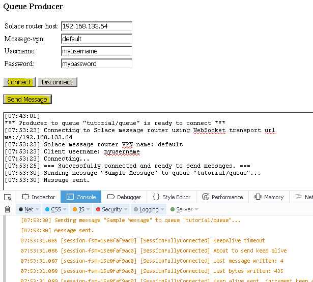
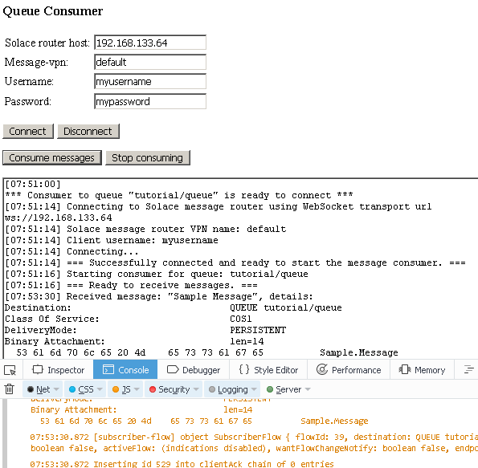

This tutorial builds on the basic concepts introduced in the [publish/subscribe tutorial](publish-subscribe), and will show you how to send and receive Persistent (Guaranteed) Messages from a Solace message router queue in a point to point fashion.

## Assumptions

This tutorial assumes the following:

*   You are familiar with Solace [core concepts]({{ site.docs-core-concepts }}){:target="_top"}.
*   You have access to Solace messaging with the following configuration details:
    *   Connectivity information for a Solace message-VPN
    *   Enabled client username and password

One simple way to get access to Solace messaging quickly is to create a messaging service in Solace Cloud [as outlined here]({{ site.links-solaceCloud-setup}}){:target="_top"}. You can find other ways to get access to Solace messaging below.

## Goals

The goal of this tutorial is to understand the following:

1.  How to send a guaranteed message to a Solace queue
2.  How to bind to this queue and receive a guaranteed message




## Prerequisite: Creating a Durable Queue on the Solace message router

A difference with the publish/subscribe tutorial is that for guaranteed messaging a physical endpoint resource – a durable queue, associated with the queue destination – needs to be created on the Solace message router, which will persist the messages until consumed.

You can use SolAdmin or SEMP to create a durable queue. This tutorial assumes that the queue named `tutorial/queue` has been created.  Ensure the queue is enabled for both Incoming and Outgoing messages and set the Permission to at least "Consume".



## Implementing Guaranteed Messaging

For guaranteed messaging, we will use a "producer" to send messages to and a "consumer" to receive messages from a durable queue configured on the Solace message router. The producer will use a `MessagePublisher` embedded into the `Session` object to send, and the consumer will bind to a queue destination and use a `MessageConsumer` object to receive guaranteed messages.

### Connecting to the Solace message router

Similar to the publish/subscribe tutorial, an application must connect a Solace session. The Solace session is the basis for all client communication with the Solace message router.

The `solace.SolclientFactory` is used to create a Solace `Session` from `SessionProperties`.

The following is an example of a session creating and connecting to the Solace message router for the producer.

Compared to the publish/subscribe tutorial, here it is not required to specify a message event listener for the `Session` object. Guaranteed messages are delivered to event listeners defined for the `MessageConsumer` object instead.

```javascript
// create session
producer.session = solace.SolclientFactory.createSession({
    // solace.SessionProperties
    url:      hosturl,
    vpnName:  vpn,
    userName: username,
    password: pass,
});
// define session event listeners
    /*...see section Session Events...*/
// connect the session
try {
    producer.session.connect();
} catch (error) {
    producer.log(error.toString());
}
```

At this point your JavaScript application is connected as a client to the Solace message router. You can use SolAdmin to view this client connection and related details.

#### Session Events

The Solace JavaScript API communicates changes in status and results of connect calls through emitting session events with certain event names.

It is necessary to wire your application logic to session events through listeners to take appropriate action. The most important session events are:

*   `SessionEventCode.UP_NOTICE`: session has been successfully connected to the Solace message router
*   `SessionEventCode.CONNECT_FAILED_ERROR`: unable to connect to the Solace message router
*   `SessionEventCode.DISCONNECTED`: session has been disconnected from the Solace message router

This is how event listeners can be defined in the sample producer, and the sample consumer is very similar:

```javascript
// define session event listeners
producer.session.on(solace.SessionEventCode.UP_NOTICE, function (sessionEvent) {
    producer.log('=== Successfully connected and ready to send messages. ===');
    producer.sendMessage();
    producer.exit();
});
producer.session.on(solace.SessionEventCode.CONNECT_FAILED_ERROR, function (sessionEvent) {
    producer.log('Connection failed to the message router: ' + sessionEvent.infoStr +
        ' - check correct parameter values and connectivity!');
});
producer.session.on(solace.SessionEventCode.DISCONNECTED, function (sessionEvent) {
    producer.log('Disconnected.');
    if (producer.session !== null) {


        producer.session.dispose();
        producer.session = null;
    }
});
```
Note that the application logic can be triggered only after receiving the `solace.SessionEventCode.UP_NOTICE` event.


### Sending a message to a queue

Now it is time to send a message to the queue. Remember that the queue must be pre-configured on the message router as described in the "Creating a Durable Queue" section.


In the simplest case, the actual method calls to create and send guaranteed messages to a queue are similar to those used for direct messages in the publish/subscribe tutorial. The differences are:
* a durable queue type destination is created and used; and
* the delivery mode is set to PERSISTENT.
* delivery to the Solace message router is confirmed (shown in the [Confirmed Delivery tutorial.](confirmed-delivery))

```javascript
var messageText = 'Sample Message';
var message = solace.SolclientFactory.createMessage();
producer.log('Sending message "' + messageText + '" to queue "' + producer.queueName + '"...');
message.setDestination(solace.SolclientFactory.createDurableQueueDestination(producer.queueName));
message.setBinaryAttachment(messageText);
message.setDeliveryMode(solace.MessageDeliveryModeType.PERSISTENT);
try {
    // Delivery not yet confirmed. See ConfirmedPublish.js
    producer.session.send(message);
    producer.log('Message sent.');
} catch (error) {
    producer.log(error.toString());
}
```

The message is transferred to the Solace message router asynchronously, but if all goes well, it will be waiting for your consumer on the queue. The [Confirmed Delivery tutorial](confirmed-delivery) shows how to make sure it gets there.

### Receiving a message from a queue

Now it is time to receive the messages sent to your queue.



Receiving guaranteed messages is different from the direct messaging case described in the the publish/subscribe tutorial.

To receive guaranteed messages, a connected `Session` is used to create a Solace `MessageConsumer` object from `MessageConsumerProperties` and then connected, meaning that it will bind to the queue on the message router and can start receiving messages.

```javascript
// Create message consumer
consumer.messageConsumer = consumer.session.createMessageConsumer({
    // solace.MessageConsumerProperties
    queueDescriptor: { name: consumer.queueName, type: solace.QueueType.QUEUE },
    acknowledgeMode: solace.MessageConsumerAcknowledgeMode.CLIENT, // Enabling Client ack
});
// define message consumer event listeners
    /*...see section Message Consumer Events...*/
// define message received event listener
    /*...see section Message Consumer Message Received Event...*/
// connect the message consumer
try {
    consumer.messageConsumer.connect();
} catch (error) {
    consumer.log(error.toString());
}
```

Notice that here we use the Solace "Client acknowledgement mode", which allows the consumers to acknowledge each message individually. You can learn more about acknowledgement modes in the [Solace Documentation – Acknowledging Messages Received by Clients]({{ site.docs-msg-consumer-ack-modes }}){:target="_top"}.

```javascript
    acknowledgeMode: solace.MessageConsumerAcknowledgeMode.CLIENT, // Enabling Client ack
```

#### Message Consumer Events

Message consumer related events will be sent to the event listeners defined for the `MessageConsumer`. The most important events are:

*   `MessageConsumerEventName.UP`: the message consumer has successfully bound to the destination and ready to receive messages
*   `MessageConsumerEventName.CONNECT_FAILED_ERROR`: the message consumer has not been able to bind to the destination
*   `MessageConsumerEventName.DOWN`: the message consumer has been disconnected.

```javascript
// Define message consumer event listeners
consumer.messageConsumer.on(solace.MessageConsumerEventName.UP, function () {
    consumer.consuming = true;
    consumer.log('=== Ready to receive messages. ===');
});
consumer.messageConsumer.on(solace.MessageConsumerEventName.CONNECT_FAILED_ERROR, function () {
    consumer.consuming = false;
    consumer.log('=== Error: the message consumer could not bind to queue "' + consumer.queueName +
        '" ===\n   Ensure this queue exists on the message router vpn');
});
consumer.messageConsumer.on(solace.MessageConsumerEventName.DOWN, function () {
    consumer.consuming = false;
    consumer.log('=== An error happened, the message consumer is down ===');
});
```

#### Message Consumer Message Received Event

Message received events will be sent to the message received event listener defined for the message consumer. Successful processing of a message must be explicitly acknowledged because "client acknowledgement mode" is used:

```javascript
// Define message received event listener
consumer.messageConsumer.on(solace.MessageConsumerEventName.MESSAGE, function (message) {
    consumer.log('Received message: "' + message.getBinaryAttachment() + '",' +
        ' details:\n' + message.dump());
    // Need to explicitly ack otherwise it will not be deleted from the message router
    message.acknowledge();
});
```

## Summarizing

Combining the example source code shown above results in the following source code files:

<ul>

<li><a href="{{ site.repository }}{{ item.link }}" target="_blank">{{ item.label }}</a></li>

</ul>

Learn how to verify all messages arrive to the Solace message router in our next tutorial, [Confirmed Delivery](confirmed-delivery).

### Getting the Source

Clone the GitHub repository containing the Solace samples.

```
git clone {{ site.repository }}
cd {{ site.repository | split: '/' | last}}
```

Note: the code in the `master` branch of this repository depends on Solace JavaScript API version 10 or later. If you want to work with an older version clone the branch that corresponds your version.

### Installing the Web Messaging API for JavaScript

It is assumed that the `lib` directory containing the API libraries will be installed at the root of the cloned `solace-samples-javascript` repository:

```bash
cp -R <path_to_unzipped_API_distribution_package>/lib/ .
```


### Running the Samples

The samples consist of two separate producer and consumer browser applications, each comes as a pair: one HTML file and one JavaScript file that is loaded by the HTML file.

**Sample Output**

First open `src/basic-samples/QueueConsumer/QueueConsumer.html` page in the browser and connect to a Solace router by specifying the message router properties and clicking "Connect" button.

Then bind to the destination queue by clicking the "Consume messages" button.


The following is a screenshot of the tutorial’s `QueueConsumer.html` web page with the JavaScript debug console open in the Firefox browser. It captures the page after it was loaded and the "Connect" button was clicked and then the "Consume messages" button was clicked.




Now, open `src/basic-samples/QueueProducer/QueueProducer.html` page in the browser and connect to the same Solace router by specifying the message router properties and clicking "Connect" button.

Send messages by clicking the "Send Message" button on the page.


The following screenshots of the tutorial’s `QueueProducer.html` and `QueueConsumer.html` web pages with the JavaScript debug console open in the Firefox browser. It captures the pages after a message was sent and received.

This is the producer is sending a message (`QueueProducer.html)`:




This is the consumer is receiving a message (`QueueConsumer.html)`:




You have now successfully connected a client, sent guaranteed messages to a queue and received them from a message consumer.

If you have any issues sending and receiving a message, check the [Solace community]({{ site.links-community }}){:target="_top"} for answers to common issues.
