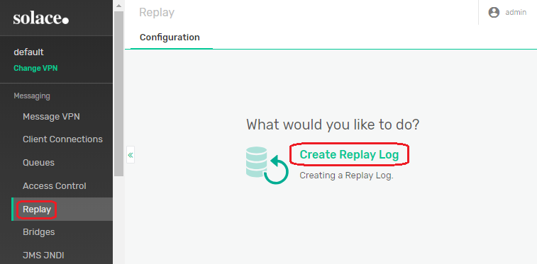
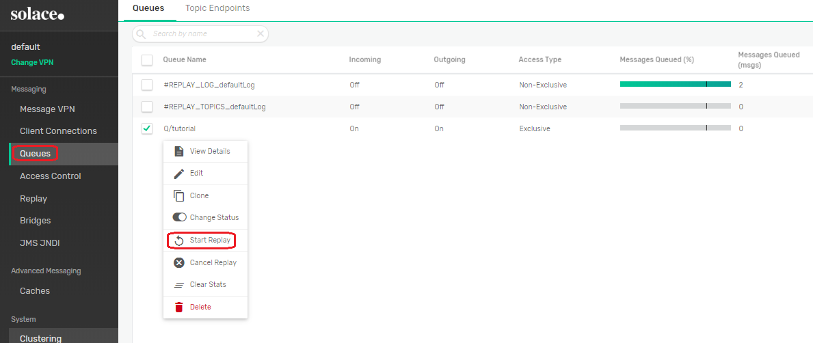

In this introduction we show you how a client can initiate and process the replay of previously published messages, as well as deal with an externally initiated replay.

## Feature Overview

During normal publishing, guaranteed messages will be removed from the message broker's [queue or topic endpoint](https://docs.solace.com/PubSub-Basics/Endpoints.htm) once the consumer acknowledges their receipt or successful processing. When Message Replay is initiated for an endpoint, the message broker will re-publish a requested subset of previously published and logged messages, which enables the client to process these messages again.

Message Replay can be used if a client needs to catch up with missed messages as well as for several other [use cases](https://docs.solace.com/Overviews/Message-Replay-Overview.htm).

Message Replay for an endpoint can be initiated programmatically from an API client connected to an exclusive endpoint, or administratively from the message broker. After the replay is done, the connected client will keep getting live messages delivered.

It's important to note that when initiating replay, the message broker will disconnect all connected client flows, active or not. A new flow needs to be started for a client wishing to receive replayed and subsequent messages. The only exception is that in the client initiated case the flow initiating the replay will not be disconnected.

## Prerequisite

A replay log must be created on the message broker for the Message VPN using [Message Replay CLI configuration](https://docs.solace.com/Configuring-and-Managing/Msg-Replay-Config.htm) or using [Solace PubSub+ Manager](https://docs.solace.com/Solace-PubSub-Manager/PubSub-Manager-Overview.htm) administration console. Another option for configuration is to use the [SEMP API](https://docs.solace.com/SEMP/Using-SEMP.htm).

**NOTE:** Message Replay is supported on Solace PubSub+ 3530 and 3560 appliances running release 9.1 and greater, and on the Solace PubSub+ software message broker running release 9.1 and greater. Solace C API version 10.5 or later is required.



## Code

### Checking for Message Replay capability

Message Replay must be supported on the message broker, so this should be the first thing the code checks:

```cpp
if ( !solClient_session_isCapable ( session_p, SOLCLIENT_SESSION_CAPABILITY_MESSAGE_REPLAY ) ) {

    printf ( "Message replay not supported on this message broker.\n" );
    return -1;
}
```

### Initiating replay

First, a "replay start location" needs to be configured in the flow properties to specify the desired subset of messages in the replay log.

There are two options:
* use `SOLCLIENT_FLOW_PROP_REPLAY_START_LOCATION_BEGINNING` to replay all logged messages
* use `DATE:date` to replay all logged messages received starting from a specified `date`. Note the different possible formats in the example including how to specify the time zone.

Note: The `date` can't be earlier than the date the replay log was created, otherwise replay will fail.

```cpp
flowProps[propIndex++] = SOLCLIENT_FLOW_PROP_REPLAY_START_LOCATION;
flowProps[propIndex] = SOLCLIENT_FLOW_PROP_REPLAY_START_LOCATION_BEGINNING;

/***************************************************************
 * Alternative replay start specifications to try instead of
 * SOLCLIENT_FLOW_PROP_REPLAY_START_LOCATION_BEGINNING.
 */
 /* Seconds since UNIX epoch: */
 // flowProps[propIndex] = "DATE:1554331492";

 /* RFC3339 UTC date with timezone offset 0: */
 // flowProps[propIndex] = "DATE:2019-04-03T18:48:00Z";

 /* RFC3339 date with timezone: */
 // flowProps[propIndex] = "DATE:2019-04-03T18:48:00Z-05:00";
```

Replay is requested by setting a non-NULL `SOLCLIENT_FLOW_PROP_REPLAY_START_LOCATION` property and non-NULL location value in the flow properties, which is then passed to `solClient_session_createFlow()` as a parameter.

The target endpoint for replay is also set in the flow properties below, which is the normal way of setting an endpoint for a consumer flow.

```cpp
/* Flow Properties */
const char     *flowProps[20] = {NULL};
int             provIndex;
:
flowProps[propIndex++] = SOLCLIENT_FLOW_PROP_ACKMODE;
flowProps[propIndex++] = SOLCLIENT_FLOW_PROP_ACKMODE_CLIENT;
:
flowProps[propIndex++] = SOLCLIENT_FLOW_PROP_BIND_NAME;
flowProps[propIndex++] = argv[5];         // queue name taken from input param
:
flowProps[propIndex++] = SOLCLIENT_FLOW_PROP_REPLAY_START_LOCATION;
flowProps[propIndex++] = SOLCLIENT_FLOW_PROP_REPLAY_START_LOCATION_BEGINNING;
:
/**************************************************************
 * NULL terminating the flow properties array
 **************************************************************/
flowProps[propIndex++] = NULL;
flowProps[propIndex] = NULL;
:
/*
 * Create and start a consumer flow
 */
int rc = solClient_session_createFlow ( ( char ** ) flowProps,
        session_p,
        &flow_p, &flowFuncInfo, sizeof ( flowFuncInfo ) );
printf ( "Waiting for 10 messages......\n" );
``` 

### Replay-related events

`SOLCLIENT_FLOW_EVENT_DOWN_ERROR` is the replay-related event that has several SubCodes defined corresponding to various conditions, which can be processed in the `flowEventCallback` callback.

Note that in the C API, the flow event callback is called on the main reactor thread, and manipulating the `session` from here isn't allowed because it can lead to deadlock. Instead we save the error information for processing by the main thread (see next section).

Some of the important SubCodes:
* SOLCLIENT_SUBCODE_REPLAY_STARTED - a replay has been administratively started from the message broker; the consumer flow is being disconnected.
* SOLCLIENT_SUBCODE_REPLAY_START_TIME_NOT_AVAILABLE - the requested replay start date is before when the replay log was created, which is not allowed - see above section, "Initiating replay"
* SOLCLIENT_SUBCODE_REPLAY_FAILED - indicates that an unexpected error has happened during replay

For the definition of additional replay-related SubCodes refer to the `solClient_subCode` enumeration definitions in the [developer documentation](https://docs.solace.com/API-Developer-Online-Ref-Documentation/c/globals_enum.html).

Here is the code of the `flowEventCallback` callback to process events with some more example SubCodes. The event handler will set `flowErrorInfo_p->subCode`, which is the same as `flowErrorInfo.subCode` and will be used in the main thread.

```cpp
    static void
flowEventCallback ( solClient_opaqueFlow_pt opaqueFlow_p, solClient_flow_eventCallbackInfo_pt eventInfo_p, void *user_p )
{
    /*
     * The flow can not be destroyed and re-created from this callback,
     *  so the errorInfo is only saved instead, and processed on the main loop.
     */
    solClient_errorInfo_pt errorInfo_p = solClient_getLastErrorInfo();
    printf ( "flowEventCallbackFunc() called - %s; subCode: %s, responseCode: %d, reason: \"%s\"\n",
            solClient_flow_eventToString ( eventInfo_p->flowEvent ),
            solClient_subCodeToString ( errorInfo_p->subCode ), errorInfo_p->responseCode, errorInfo_p->errorStr );

    if ( SOLCLIENT_FLOW_EVENT_DOWN_ERROR == eventInfo_p->flowEvent ) {
        solClient_errorInfo_pt flowErrorInfo_p = (solClient_errorInfo_pt) user_p;
        flowErrorInfo_p->responseCode = errorInfo_p->responseCode;
        flowErrorInfo_p->subCode = errorInfo_p->subCode;
        strncpy(errorInfo_p->errorStr, flowErrorInfo_p->errorStr, sizeof(flowErrorInfo_p->errorStr));
        switch (errorInfo_p->subCode) {
            case SOLCLIENT_SUBCODE_REPLAY_STARTED:
            case SOLCLIENT_SUBCODE_REPLAY_FAILED:
            case SOLCLIENT_SUBCODE_REPLAY_CANCELLED:
            case SOLCLIENT_SUBCODE_REPLAY_LOG_MODIFIED:
            case SOLCLIENT_SUBCODE_REPLAY_START_TIME_NOT_AVAILABLE:
            case SOLCLIENT_SUBCODE_REPLAY_MESSAGE_UNAVAILABLE:
            case SOLCLIENT_SUBCODE_REPLAY_MESSAGE_REJECTED:
                break;
            default:
                break;
        }

    }
}
:
flowFuncInfo.eventInfo.callback_p = flowEventCallback;
:
/*
 * flowErrorInfo will be set by the flow event handler callback
 */
solClient_errorInfo_t flowErrorInfo = {SOLCLIENT_SUBCODE_OK, 0, ""};
flowFuncInfo.eventInfo.user_p = &flowErrorInfo;
:
/*
 * Create and start a consumer flow
 */
int rc = solClient_session_createFlow ( ( char ** ) flowProps,
        session_p,
        &flow_p, &flowFuncInfo, sizeof ( flowFuncInfo ) );
```

### Replay-related event handling

If a replay-related event occurs `flowErrorInfo.subCode` is set by the flow event handler callback.

In this example two event SubCodes are handled in the main thread:
* SOLCLIENT_SUBCODE_REPLAY_STARTED is handled by destroying the old flow and creating a new one. 
* SOLCLIENT_SUBCODE_REPLAY_START_TIME_NOT_AVAILABLE is handled by adjusting the "replay start location" to replay all logged messages. 

```cpp
if (flowErrorInfo.subCode == SOLCLIENT_SUBCODE_REPLAY_STARTED) {
    printf ( "Router initiating replay, reconnecting flow to receive messages.\n" );
    :
    solClient_flow_destroy(&flow_p);
    /*
     * Remove the REPLAY_START_LOCATION from the flow properties array
     * (replace it by NULL)
     * as it would override the operator initiated replay request.
     * NOTE: the REPLAY_START_LOCATION must be the last property
     * for this to work.
     */
    propIndex = replayStartLocationIndex;
    flowProps[propIndex++] = NULL;
    flowProps[propIndex] = NULL;

    rc = solClient_session_createFlow ( ( char ** ) flowProps,
            session_p,
            &flow_p, &flowFuncInfo, sizeof ( flowFuncInfo ) );
    :
} else if (flowErrorInfo.subCode == SOLCLIENT_SUBCODE_REPLAY_START_TIME_NOT_AVAILABLE) {
    :
    printf ( "Replay log does not cover requested time period, reconnecting flow for full log instead.\n" );
    :
    flowProps[replayStartLocationIndex + 1] = SOLCLIENT_FLOW_PROP_REPLAY_START_LOCATION_BEGINNING;
    solClient_flow_destroy(&flow_p);
    rc = solClient_session_createFlow ( ( char ** ) flowProps,
            session_p,
            &flow_p, &flowFuncInfo, sizeof ( flowFuncInfo ) );
    :
}
```

## Running the Sample

Follow the instructions to [check out and build the samples](https://github.com/SolaceSamples/solace-samples-c/blob/master/README.md#checking-out-and-building).

Before running this sample, be sure that Message Replay is enabled in the Message VPN. Also, messages must have been published to the replay log for the queue that is used. The "QueueProducer" sample can be used to create and publish messages to the queue. The "QueueConsumer" sample can be used to drain the queue so that replay is performed on an empty queue and observed by this sample. Both samples are from the [Persistence with Queues](../persistence-with-queues/) tutorial.

From the "bin" directory:
```sh
$ ./QueuePublisher  <msg_backbone_ip:port> <vpn> <client-username> <password> Q/tutorial
$ ./QueueSubscriber <msg_backbone_ip:port> <vpn> <client-username> <password> Q/tutorial
```

At this point the replay log has one message.

You can now run this sample and observe the following, particularly the "messageId"s listed:

1. First, a client initiated replay is started when the flow connects. All messages are requested and replayed from the replay log.
```sh
$ ./MessageReplay <msg_backbone_ip:port> <vpn> <client-username> <password> Q/tutorial
```
2. After replay the application is able to receive live messages. Try it by publishing a new message using the "QueueProducer" sample from another terminal. Note that this message will also be added to the replay log.
```sh
$ ./QueuePublisher  <msg_backbone_ip:port> <vpn> <client-username> <password> Q/tutorial
```
3. Now start a replay from the message broker. The flow event callback monitors for a replay start event. When the message broker initiates a replay, the flow will see a `SOLCLIENT_FLOW_EVENT_DOWN_ERROR` event with SubCode `SOLCLIENT_SUBCODE_REPLAY_STARTED`. This means an administrator has initiated a replay, and the application must destroy and re-create the flow to receive the replayed messages.
This will replay all logged messages including the live one published in step 2.



## Learn More

* Related Source Code: [MessageReplay.c](https://github.com/SolaceSamples/solace-samples-c/blob/master/src/intro/MessageReplay.c)
* [Solace Feature Documentation](https://docs.solace.com/Overviews/Message-Replay-Overview.htm)