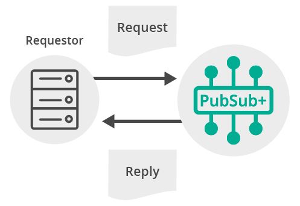
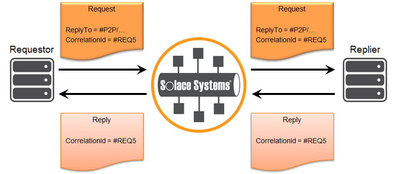
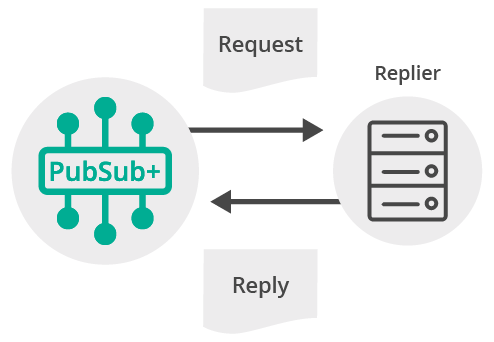

This tutorial outlines both roles in the request-response message exchange pattern. It will show you how to act as the client by creating a request, sending it and waiting for the response. It will also show you how to act as the server by receiving incoming requests, creating a reply and sending it back to the client. It builds on the basic concepts introduced in [publish/subscribe tutorial](../publish-subscribe/).

At the end, this tutorial walks through downloading and running the sample from source.

This tutorial focuses on using a non-Solace JMS API implementation. For using the Solace JMS API see [Solace Getting Started JMS Tutorials](../../solace-samples-jms/).

## Assumptions

This tutorial assumes the following:

*   You are familiar with Solace [core concepts](https://docs.solace.com/PubSub-Basics/Core-Concepts.htm).
*   You have access to Solace messaging with the following configuration details:
    *   Connectivity information for a Solace message-VPN
    *   Enabled client username and password

One simple way to get access to Solace messaging quickly is to create a messaging service in Solace Cloud [as outlined here](https://solace.com/cloud/). You can find other ways to get access to Solace messaging below.

## Goals

The goal of this tutorial is to demonstrate how to use Apache Qpid JMS 2.0 API over AMQP using the Solace Message Router. This tutorial will show you:

1. How to build and send a request message
2. How to receive a request message and respond to it

`markdown:solaceMessaging-part1.md`

`markdown:solaceMessaging-part2.md`
`markdown:jmsApi.md`

## Java Messaging Service (JMS) Introduction

JMS is a standard API for sending and receiving messages. As such, in addition to information provided on the Solace developer portal, you may also look at some external sources for more details about JMS. The following are good places to start

1. [http://java.sun.com/products/jms/docs.html](http://java.sun.com/products/jms/docs.html)
2. [https://en.wikipedia.org/wiki/Java_Message_Service](https://en.wikipedia.org/wiki/Java_Message_Service)
3. [https://docs.oracle.com/javaee/7/tutorial/partmessaging.htm#GFIRP3](https://docs.oracle.com/javaee/7/tutorial/partmessaging.htm#GFIRP3)

The last (Oracle docs) link points you to the JEE official tutorials which provide a good introduction to JMS.

This tutorial focuses on using [JMS 2.0 (May 21, 2013)](https://download.oracle.com/otndocs/jcp/jms-2_0-fr-spec/), for [JMS 1.1 (April 12, 2002)](https://download.oracle.com/otndocs/jcp/7195-jms-1.1-fr-spec-oth-JSpec/) see [Solace Getting Started AMQP JMS 1.1 Tutorials](https://docs.solace.com/Configuring-and-Managing/AMQP-Tasks/Managing-AMQP-Messaging.htm).

## Connecting to the Solace Messaging

In order to send or receive messages, an application must start a JMS connection and a session.

There are three parameters for establishing the JMS connection: the Solace messaging host name with the AMQP service port number, the client username and the optional password.

*BasicRequestor.java/BasicReplier.java*
```java
String solaceHost = args[0];
String solaceUsername = args[1];
String solacePassword = args[2];
ConnectionFactory connectionFactory = new JmsConnectionFactory(solaceUsername, solacePassword, solaceHost);
```

Notice how JMS 2.0 API combines `Connection` and `Session` objects into the `JMSContext` object.

*BasicRequestor.java/BasicReplier.java*
```java
JMSContext context = connectionFactory.createContext()
```

The session created by the `JMSContext` object by default is non-transacted and uses the acknowledge mode that automatically acknowledges a client's receipt of a message.

Notice how JMS 2.0 API combines `Connection` and `Session` objects into the `JMSContext` object.

At this point the application is connected to Solace messaging and ready to send and receive request and reply messages.

## Sending a request

In order to send a request a JMS *Producer* needs to be created.



Also, it is necessary to allocate a temporary queue for receiving the reply.

*BasicRequestor.java*
```java
TemporaryQueue replyToQueue = context.createTemporaryQueue();
```

The request must have two properties assigned: `JMSReplyTo` and `JMSCorrelationID`.

The `JMSReplyTo` property needs to have the value of the temporary queue for receiving the reply that was already created.

The `JMSCorrelationID` property needs to have an unique value so the requestor to correlate the request with the subsequent reply.

The figure below outlines the exchange of messages and the role of both properties.



*BasicRequestor.java*
```java
TextMessage request = context.createTextMessage("Sample Request");
request.setJMSReplyTo(replyToQueue);
String correlationId = UUID.randomUUID().toString();
request.setJMSCorrelationID(correlationId);
```

Now we create a JMS producer and send the request. We assign the delivery mode to `non-persistent` for better performance.

The JMS 2.0 API allows the use of *method chaining* to create the producer, set the delivery mode and send the message.

*BasicRequestor.java*
```java
final String REQUEST_TOPIC_NAME = "T/GettingStarted/requests";

Topic requestTopic = context.createTopic(REQUEST_TOPIC_NAME);
context.createProducer().setDeliveryMode(DeliveryMode.NON_PERSISTENT).send(requestTopic, request);
```

## Receiving a request

In order to receive a request from a queue a JMS *Consumer* needs to be created.

We create a JMS consumer and receive the request in the same, main thread.

The JMS 2.0 API allows the use of *method chaining* to create the consumer and receive a message from the queue.

*BasicReplier.java*
```java
Topic requestTopic = context.createTopic(REQUEST_TOPIC_NAME);
Message request = context.createConsumer(requestTopic).receive();
```

## Replying to a request

To reply to a received request a JMS *Producer* needs to be created.



The reply message must have the `JMSCorrelationID` property value assigned from the received request. Create the reply message using the current `JMSContext` and assign its `JMSCorrelationID` property from the request value:

*BasicReplier.java*
```java
Message request = context.createConsumer(requestTopic).receive();

TextMessage reply = context.createTextMessage();
String text = "Sample response";
reply.setText(text);
reply.setJMSCorrelationID(request.getJMSCorrelationID());
```

Now we can send the reply message.

We must send it to the temporary queue that was created by the requestor. Create an instance of the `org.apache.qpid.jms.JmsDestination` class for the reply destination and assign it a name from the request `JMSReplyTo` property because of the way the Apache Qpid JMS client is implementated.

*BasicReplier.java*
```java
Destination replyDestination = request.getJMSReplyTo();
String replyDestinationName = ((JmsDestination) replyDestination).getName();
replyDestination = new JmsTemporaryQueue(replyDestinationName);
```

A JMS producer needs to be created to send the reply message. Assign its delivery mode to `non-persistent` for better performance.

The JMS 2.0 API allows the use of *method chaining* to create the producer, set the delivery mode and send the reply message.

*BasicReplier.java*
```java
context.createProducer().setDeliveryMode(DeliveryMode.NON_PERSISTENT).send(replyDestination, reply);
```

The reply will be received in the main thread by the `BasicRequestor`.

*BasicRequestor.java*
```java
final int REPLY_TIMEOUT_MS = 10000;

Message reply = context.createConsumer(replyToQueue).receive(REPLY_TIMEOUT_MS);
```

If you execute the `BasicReplier.java` program, it will block at the `context.createConsumer(requestTopic).receive()` call until a request is received. Now, if you execute the `BasicRequestor.java` that sends the request, the `BasicReplier.java` program will resume and reply to the request. That will unblock the `BasicRequestor.java` program that was blocked on the `context.createConsumer(replyToQueue).receive(REPLY_TIMEOUT_MS)` call waiting for the reply to its request.


## Summarizing

Combining the example source code shown above results in the following source code files:

* [BasicRequestor.java](https://github.com/SolaceSamples/solace-samples-amqp-qpid-jms2/blob/master/src/main/java/com/solace/samples/BasicRequestor.java)
* [BasicReplier.java](https://github.com/SolaceSamples/solace-samples-amqp-qpid-jms2/blob/master/src/main/java/com/solace/samples/BasicReplier.java)

### Getting the Source

Clone the GitHub repository containing the Solace samples.

```
git clone https://github.com/SolaceSamples/solace-samples-amqp-qpid-jms2
cd solace-samples-amqp-qpid-jms2
```

### Building

You can build and run both example files directly from Eclipse or with Gradle.

```sh
./gradlew assemble
```

The examples can be run as:

```sh
cd build/staged/bin
./basicReplier amqp://<HOST:AMQP_PORT> <USERNAME> <PASSWORD>
./basicRequestor amqp://<HOST:AMQP_PORT> <USERNAME> <PASSWORD>
```


### Sample Output

First start the `BasicReplier` so that it is up and waiting for requests.

```sh
$ basicReplier amqp://<HOST:AMQP_PORT> <USERNAME> <PASSWORD>
BasicReplier is connecting to Solace router amqp://<HOST:AMQP_PORT>...
Connected to the Solace router with client username 'clientUsername'.
Awaiting request...
```

Then you can start the `BasicRequestor` to send the request and receive the reply.
```sh
$ basicRequestor amqp://<HOST:AMQP_PORT> <USERNAME> <PASSWORD>
BasicRequestor is connecting to Solace router amqp://<HOST:AMQP_PORT>...
Connected to the Solace router with client username 'clientUsername'.
Sending request 'Sample Request' to topic 'T/GettingStarted/requests'...
Sent successfully. Waiting for reply...
TextMessage response received: 'Sample response'
Message Content:
JmsTextMessage { org.apache.qpid.jms.provider.amqp.message.AmqpJmsTextMessageFacade@527740a2 }
```

Notice how the request is received by the `BasicReplier` and replied to.

```sh
Awaiting request...
Received request, responding...
Responded successfully. Exiting...
```

Now you know how to use Apache Qpid JMS 2.0 API over AMQP using Solace messaging to implement the request/reply message exchange pattern.